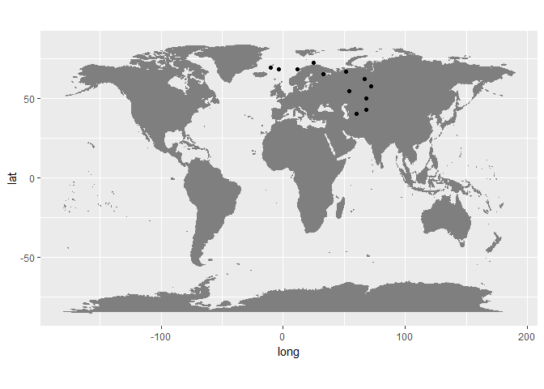

Graphic detail: The Chinese Century
================

This is walk-through of the script required to reproduce the data and charts behind "The Chinese Century" published by The Economist, October 25th 2018

``` r
#Set-up for srcipt 
#path <- "your path to our repo"
#setwd(path)

#Call in libraries
libs <- c("tidyverse", "WDI", "reshape2", "readxl", "countrycode")
lapply(libs, require, character.only=T)
```

    ## Loading required package: tidyverse

    ## -- Attaching packages --------------------------------------- tidyverse 1.2.1 --

    ## v ggplot2 3.0.0     v purrr   0.2.4
    ## v tibble  1.4.2     v dplyr   0.7.5
    ## v tidyr   0.8.1     v stringr 1.3.1
    ## v readr   1.1.1     v forcats 0.3.0

    ## -- Conflicts ------------------------------------------ tidyverse_conflicts() --
    ## x dplyr::filter() masks stats::filter()
    ## x dplyr::lag()    masks stats::lag()

    ## Loading required package: WDI

    ## Loading required package: RJSONIO

    ## Loading required package: reshape2

    ## 
    ## Attaching package: 'reshape2'

    ## The following object is masked from 'package:tidyr':
    ## 
    ##     smiths

    ## Loading required package: readxl

    ## Loading required package: countrycode

    ## [[1]]
    ## [1] TRUE
    ## 
    ## [[2]]
    ## [1] TRUE
    ## 
    ## [[3]]
    ## [1] TRUE
    ## 
    ## [[4]]
    ## [1] TRUE
    ## 
    ## [[5]]
    ## [1] TRUE

We spent some time cleaning up historic GDP data from the Maddison Project Database, and merging that data with forecasts for world economic growth from the Economist Intelligence Unit. You can find Maddison data here : <https://www.rug.nl/ggdc/historicaldevelopment/maddison/releases/maddison-project-database-2018>

As you'll see, we don't have data for all years nor all countries, back to 1AD, but it's the best there is.

``` r
gdp <- read_csv("inputs/gdp.csv")
```

    ## Warning: Missing column names filled in: 'X1' [1]

    ## Parsed with column specification:
    ## cols(
    ##   X1 = col_integer(),
    ##   iso = col_character(),
    ##   year = col_integer(),
    ##   gdp.pct.share = col_double()
    ## )

``` r
count(gdp, year)
```

    ## # A tibble: 12 x 2
    ##     year     n
    ##    <int> <int>
    ##  1     1    43
    ##  2  1600    48
    ##  3  1800    48
    ##  4  1850    92
    ##  5  1900    93
    ##  6  1950   166
    ##  7  1960   167
    ##  8  1980   167
    ##  9  2000   167
    ## 10  2010   167
    ## 11  2018   162
    ## 12  2025   162

We found the centre of each country, ie, it's latitude and longitude, via <https://atcoordinates.info/resources/> We've assumed that a country's border hasn't changed over the years -- not true! -- but it's a good enough approximation for these purposes.

``` r
latlon.cou <- read.csv("inputs/country_centroids_all.csv", sep = "\t", stringsAsFactors = F) %>%
  select(iso2 = ISO3136, SHORT_NAME, LAT, LONG) %>%
  mutate(iso = countrycode(iso2, "iso2c", "iso3c")) %>%
  mutate(iso = ifelse(SHORT_NAME == "Namibia", "NAM", iso)) %>%
  bind_rows(., read.csv("inputs/missing_lat_longs.csv", stringsAsFactors=F)) %>% #add in missing lat~longs
  rename(cou.lon = LONG, cou.lat = LAT)
```

    ## Warning in countrycode(iso2, "iso2c", "iso3c"): Some values were not matched unambiguously:

``` r
summary(latlon.cou)
```

    ##      iso2            SHORT_NAME           cou.lat       cou.lon       
    ##  Length:259         Length:259         Min.   :-56   Min.   :-176.20  
    ##  Class :character   Class :character   1st Qu.: -1   1st Qu.: -54.00  
    ##  Mode  :character   Mode  :character   Median : 16   Median :  18.50  
    ##                                        Mean   : 16   Mean   :  12.80  
    ##                                        3rd Qu.: 39   3rd Qu.:  47.88  
    ##                                        Max.   : 78   Max.   : 178.00  
    ##      iso           
    ##  Length:259        
    ##  Class :character  
    ##  Mode  :character  
    ##                    
    ##                    
    ## 

Next we need to convert our spherical coordinates to Cartesian coordinates. h/t &gt;&gt;&gt; <https://rbrundritt.wordpress.com/2008/10/14/conversion-between-spherical-and-cartesian-coordinates-systems/>)

``` r
#Function 
earthRadius <- 1 #radius in km (6367)
conv.coord.f <- function(lat, lon) { 
  lat = lat / 180 * pi
  lon = lon / 180 * pi
  x = earthRadius * cos(lat)*cos(lon);
  y = earthRadius * cos(lat)*sin(lon);
  z = earthRadius * sin(lat);
  cart <- c(x, y, z) %>% t(.)
  return(cart) }

#apply function above, bind to df. 
cart.coord <- mapply(conv.coord.f, latlon.cou$cou.lat, latlon.cou$cou.lon) %>% t(.) %>% 
  as.data.frame(.) %>% rename(x=V1, y=V2, z=V3)
latlon.cou <- bind_cols(latlon.cou, cart.coord)
head(latlon.cou); tail(latlon.cou)
```

    ##   iso2     SHORT_NAME   cou.lat cou.lon iso          x           y
    ## 1   AF    Afghanistan  33.00000    66.0 AFG  0.3411181  0.76616369
    ## 2   AL        Albania  41.00000    20.0 ALB  0.7091950  0.25812588
    ## 3   DZ        Algeria  28.00000     3.0 DZA  0.8817375  0.04620991
    ## 4   AS American Samoa -14.33333  -170.0 ASM -0.9541525 -0.16824283
    ## 5   AD        Andorra  42.50000     1.5 AND  0.7370247  0.01929967
    ## 6   AO         Angola -12.50000    18.5 AGO  0.9258446  0.30978327
    ##            z
    ## 1  0.5446390
    ## 2  0.6560590
    ## 3  0.4694716
    ## 4 -0.2475627
    ## 5  0.6755902
    ## 6 -0.2164396

    ##     iso2     SHORT_NAME   cou.lat   cou.lon iso         x          y
    ## 254   EH Western Sahara  25.00000 -13.50000 ESH 0.8812664 -0.2115734
    ## 255   YE          Yemen  15.50000  47.50000 YEM 0.6510193  0.7104629
    ## 256   ZM         Zambia -15.00000  30.00000 ZMB 0.8365163  0.4829629
    ## 257   ZW       Zimbabwe -19.00000  29.00000 ZWE 0.8269692  0.4583965
    ## 258   YU     Yugoslavia  44.20045  19.36673 YUG 0.6763393  0.2377354
    ## 259   CZ  Czechslovakia  49.07477  18.04214 CSK 0.6228630  0.2028870
    ##              z
    ## 254  0.4226183
    ## 255  0.2672384
    ## 256 -0.2588190
    ## 257 -0.3255682
    ## 258  0.6971707
    ## 259  0.7555650

We add our Cartesian coordinates data to our main data frame, let's call it "DATA"

``` r
DATA <- gdp %>%
  left_join(., select(latlon.cou, -iso2, -SHORT_NAME), by = "iso")
head(DATA); tail(DATA)
```

    ## # A tibble: 6 x 9
    ##      X1 iso    year gdp.pct.share cou.lat cou.lon       x       y      z
    ##   <int> <chr> <int>         <dbl>   <dbl>   <dbl>   <dbl>   <dbl>  <dbl>
    ## 1     1 ALB       1        0.150     41      20    0.709   0.258   0.656
    ## 2     2 AUS       1        0.165    -25     135   -0.641   0.641  -0.423
    ## 3     3 AUT       1        0.230     47.3    13.3  0.659   0.156   0.735
    ## 4     4 BEL       1        0.243     50.8     4    0.630   0.0441  0.775
    ## 5     5 BGR       1        0.375     43      25    0.663   0.309   0.682
    ## 6     6 CAN       1        0.0335    60     -96   -0.0523 -0.497   0.866

    ## # A tibble: 6 x 9
    ##      X1 iso    year gdp.pct.share cou.lat cou.lon      x      y      z
    ##   <int> <chr> <int>         <dbl>   <dbl>   <dbl>  <dbl>  <dbl>  <dbl>
    ## 1  1477 VEN    2025        0.216      8     -66    0.403 -0.905  0.139
    ## 2  1478 VNM    2025        0.626     16.2   108.  -0.294  0.914  0.278
    ## 3  1479 YEM    2025        0.0331    15.5    47.5  0.651  0.710  0.267
    ## 4  1480 ZAF    2025        0.568    -30      26    0.778  0.380 -0.500
    ## 5  1481 ZMB    2025        0.0561   -15      30    0.837  0.483 -0.259
    ## 6  1482 ZWE    2025        0.0279   -19      29    0.827  0.458 -0.326

And then calcaulte the weighted average of our Cartesian coorindates.

``` r
eco.centre <- DATA %>% 
  group_by(year) %>% summarise(x = weighted.mean(x, gdp.pct.share, na.rm=T),
                               y = weighted.mean(y, gdp.pct.share, na.rm=T),
                               z = weighted.mean(z, gdp.pct.share, na.rm=T), 
                               count = n()) 
head(eco.centre); tail(eco.centre)
```

    ## # A tibble: 6 x 5
    ##    year     x       y     z count
    ##   <int> <dbl>   <dbl> <dbl> <int>
    ## 1     1 0.316  0.546  0.531    43
    ## 2  1600 0.219  0.551  0.551    48
    ## 3  1800 0.185  0.465  0.599    48
    ## 4  1850 0.251  0.347  0.602    93
    ## 5  1900 0.242  0.157  0.628    94
    ## 6  1950 0.209 -0.0366 0.566   167

    ## # A tibble: 6 x 5
    ##    year      x       y     z count
    ##   <int>  <dbl>   <dbl> <dbl> <int>
    ## 1  1960 0.222  -0.0148 0.565   168
    ## 2  1980 0.212   0.0441 0.548   168
    ## 3  2000 0.149   0.0701 0.523   168
    ## 4  2010 0.135   0.170  0.503   168
    ## 5  2018 0.105   0.243  0.495   162
    ## 6  2025 0.0969  0.295  0.484   162

To plot the data on a map, we then need to convert our Cartesian coordinates back to spherical coordinates.

``` r
#function to convert cartesian to spherical coords (from same source above)
conv.caart.f <- function(x, y, z) {
  v <- ppls::normalize.vector(c(x, y, z))
  #v <- c(x, y, z)
  lat = asin(v[[3]]) / pi * 180
  lon = atan2(v[[2]], v[[1]]) / pi * 180
  latlon <- c(lat,lon)
  return(latlon) }

#apply function, bind
coord_centroid <- mapply(conv.caart.f, eco.centre$x, eco.centre$y, eco.centre$z) %>% t(.) %>% 
  as.data.frame(.) %>% rename(lat=V1, lon=V2)
eco.centre <- bind_cols(eco.centre, coord_centroid)
head(eco.centre); tail(eco.centre)
```

    ## # A tibble: 6 x 7
    ##    year     x       y     z count   lat    lon
    ##   <int> <dbl>   <dbl> <dbl> <int> <dbl>  <dbl>
    ## 1     1 0.316  0.546  0.531    43  40.1  60.0 
    ## 2  1600 0.219  0.551  0.551    48  42.9  68.3 
    ## 3  1800 0.185  0.465  0.599    48  50.1  68.3 
    ## 4  1850 0.251  0.347  0.602    93  54.6  54.0 
    ## 5  1900 0.242  0.157  0.628    94  65.3  33.0 
    ## 6  1950 0.209 -0.0366 0.566   167  69.4  -9.91

    ## # A tibble: 6 x 7
    ##    year      x       y     z count   lat    lon
    ##   <int>  <dbl>   <dbl> <dbl> <int> <dbl>  <dbl>
    ## 1  1960 0.222  -0.0148 0.565   168  68.4  -3.80
    ## 2  1980 0.212   0.0441 0.548   168  68.4  11.7 
    ## 3  2000 0.149   0.0701 0.523   168  72.5  25.1 
    ## 4  2010 0.135   0.170  0.503   168  66.6  51.6 
    ## 5  2018 0.105   0.243  0.495   162  61.9  66.5 
    ## 6  2025 0.0969  0.295  0.484   162  57.4  71.8

For our print version we plotted the data in QGIS using a Orthographic Projection centred on Moscow.

But you can create a simple plot in R as follows:

``` r
#libs 
library(maps)
```

    ## 
    ## Attaching package: 'maps'

    ## The following object is masked from 'package:purrr':
    ## 
    ##     map

``` r
ggplot() +
  borders("world", colour="gray50", fill="gray50") +
  geom_point(data = eco.centre, aes(lon, lat)) +
  coord_fixed(1.3)
```



Write out the file.

``` r
write_csv(eco.centre, "eco_centre.csv")
```
