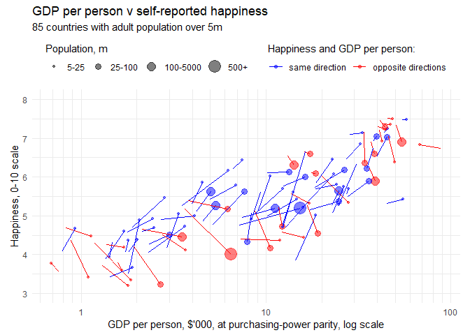

Graphic detail: Happiness economics
================

This is a walk-through of the script required to reproduce the data and charts behind the Graphic detail article, "Dismal Science: An old paradox about growth and happiness lives on", published by The Economist on March 20th 2019. Online version available at: <https://www.economist.com/graphic-detail/2019/03/21/economic-growth-does-not-guarantee-rising-happiness/>

Set up script
-------------

``` r
#Set-up for script
path <- "N:/Data/Happiness/for public repo/"
setwd(path)
options(scipen = 999)
```

Load libraries

    ## Loading required package: tidyverse

    ## -- Attaching packages -------------------------------------------------------------------------------------------------------------------------------- tidyverse 1.2.1 --

    ## v ggplot2 3.1.0     v purrr   0.2.4
    ## v tibble  1.4.2     v dplyr   0.7.5
    ## v tidyr   0.8.1     v stringr 1.3.1
    ## v readr   1.1.1     v forcats 0.3.0

    ## -- Conflicts ----------------------------------------------------------------------------------------------------------------------------------- tidyverse_conflicts() --
    ## x dplyr::filter() masks stats::filter()
    ## x dplyr::lag()    masks stats::lag()

    ## Loading required package: readxl

    ## Loading required package: countrycode

    ## Loading required package: WDI

    ## Loading required package: RJSONIO

    ## Loading required package: reshape2

    ## 
    ## Attaching package: 'reshape2'

    ## The following object is masked from 'package:tidyr':
    ## 
    ##     smiths

    ## Loading required package: knitr

Population data
---------------

Calcultate adult population for each country by year from the World Bank's World Development Indicators (we'll need it later)

``` r
#Grab population from World Bank

#Total popululation
pop <- WDI(country = "all", indicator = "SP.POP.TOTL", start = 2005, end = 2020, extra = F)
#Population aged 0-14
pop.u15 <- WDI(country = "all", indicator = "SP.POP.0014.TO", start = 2005, end = 2020, extra = F)
#Combine together, take one from other for adult population
pop <- left_join(pop, pop.u15, by = c("iso2c", "country", "year")) %>% 
  select(iso2c, country, year, pop.tot = SP.POP.TOTL, pop.u15 = SP.POP.0014.TO) %>% 
  filter(!is.na(pop.tot)) %>% mutate(pop.adult = pop.tot - pop.u15)

#Calculate 2018 population (assuming same rate of growth as 2017/2016)
pop.18 <- full_join(filter(pop, year == 2016), filter(pop, year == 2017), by = c("iso2c", "country")) %>% 
  mutate(year = 2018, pop.tot = round(pop.tot.y * (pop.tot.y/pop.tot.x), 0), 
         pop.u15 = round(pop.u15.y * (pop.u15.y/pop.u15.x), 0), 
         pop.adult = round(pop.adult.y * (pop.adult.y/pop.adult.x),0)) %>% 
  select(iso2c, country, year, pop.tot, pop.u15, pop.adult)

#Add Taiwan data (not included in WB WDI) 
#Taiwan's data is taken from National Statistics ROC (https://eng.stat.gov.tw/ct.asp?xItem=41871&ctNode=6339&mp=5))
pop.tw = data.frame(
  iso2c='TW', year=c(2006:2018),
  pop.tot=c(22958000^2/23037000, 22958000, 23037000, 23120000, 23162000, 23225000, 23316000,
        23374000, 23434000, 23492000, 23540000, 23571000, 23571000^2/23540000),
  pop.u15=c((4031000)^2/(3905000), 4031000, 3905000, 3778000, 3624000,3502000, 3412000, 3347000, 3277000,
            3188000, 3142000, 3092000, (3092000)^2/(3142000)), stringsAsFactors = F) %>% 
  mutate(pop.adult = pop.tot - pop.u15)

#Bind 2018 population, Taiwan, and all other population data together
pop <- bind_rows(pop, pop.18, pop.tw) %>% arrange(iso2c, year)
kable(head(pop)); kable(tail(pop)); count(pop, year) %>% t %>% kable
```

| iso2c | country    |  year|    pop.tot|    pop.u15|  pop.adult|
|:------|:-----------|-----:|----------:|----------:|----------:|
| 1A    | Arab World |  2005|  316264728|  112736681|  203528047|
| 1A    | Arab World |  2006|  323773264|  113853070|  209920194|
| 1A    | Arab World |  2007|  331653797|  115077993|  216575804|
| 1A    | Arab World |  2008|  339825483|  116467600|  223357883|
| 1A    | Arab World |  2009|  348145094|  118075150|  230069944|
| 1A    | Arab World |  2010|  356508908|  119921734|  236587174|

|      | iso2c | country  |  year|   pop.tot|  pop.u15|  pop.adult|
|------|:------|:---------|-----:|---------:|--------:|----------:|
| 3683 | ZW    | Zimbabwe |  2013|  15054506|  6248747|    8805759|
| 3684 | ZW    | Zimbabwe |  2014|  15411675|  6396521|    9015154|
| 3685 | ZW    | Zimbabwe |  2015|  15777451|  6542997|    9234454|
| 3686 | ZW    | Zimbabwe |  2016|  16150362|  6682925|    9467437|
| 3687 | ZW    | Zimbabwe |  2017|  16529904|  6811128|    9718776|
| 3688 | ZW    | Zimbabwe |  2018|  16918365|  6941790|    9976787|

|      |      |      |      |      |      |      |      |      |      |      |      |      |      |      |
|:-----|-----:|-----:|-----:|-----:|-----:|-----:|-----:|-----:|-----:|-----:|-----:|-----:|-----:|-----:|
| year |  2005|  2006|  2007|  2008|  2009|  2010|  2011|  2012|  2013|  2014|  2015|  2016|  2017|  2018|
| n    |   263|   264|   264|   264|   264|   264|   264|   263|   263|   263|   263|   263|   263|   263|

Happiness and GDP data
----------------------

Download and parse the self-reported the data from the World Happiness Report, 2019 <http://worldhappiness.report/ed/2019/>

Of all the variables we want just two: Life Ladder: self-reported average happiness by country and year, on 0-10 scale (Cantril ladder) Log GDP per capita: GDP per person in 2011 (constant) PPP (purchasing-power parity), $

``` r
download.file(url = "https://s3.amazonaws.com/happiness-report/2019/Chapter2OnlineData.xls", 
              destfile = paste0(path, "WHR_2019_data.xls"), mode = "wb", method = "auto")
raw.dat <- read_excel(path = "WHR_2019_data.xls", sheet = "Table2.1")

#happiness and gdp by year
dat <- raw.dat %>% select(name = `Country name`, year = Year, happy = `Life Ladder`, gdp.pc = `Log GDP per capita`) %>%
  mutate(name = ifelse(name == "Taiwan Province of China", "Taiwan", name)) %>% 
  mutate(name = ifelse(name == "Hong Kong S.A.R. of China", "Hong Kong", name)) %>% 
  #Add in ISO2c code
  mutate(iso2c = countrycode(name, origin="country.name", destination="iso2c")) %>% 
  #Merge with population data
  left_join(., select(pop, iso2c, year, pop.adult), by = c("iso2c", "year")) %>% 
  #un-log GDP (take exp)
  mutate(gdp.pc2 = exp(gdp.pc)) %>% 
  select(iso2c, name, year, happy, log.gdp.pc = gdp.pc, gdp.pc = gdp.pc2, pop.adult) %>% 
  arrange(iso2c, year) %>% 
  filter(!is.na(iso2c)) #remove some NA regions (Kosovo)
```

    ## Warning in countrycode(name, origin = "country.name", destination = "iso2c"): Some values were not matched unambiguously: Kosovo

``` r
kable(head(dat)); kable(tail(dat)); count(dat, year) %>% t %>% kable
```

| iso2c | name                 |  year|     happy|  log.gdp.pc|    gdp.pc|  pop.adult|
|:------|:---------------------|-----:|---------:|-----------:|---------:|----------:|
| AE    | United Arab Emirates |  2006|  6.734222|    11.38607|  88086.37|    4365939|
| AE    | United Arab Emirates |  2009|  6.866063|    11.01485|  60769.89|    6600994|
| AE    | United Arab Emirates |  2010|  7.097455|    10.95488|  57232.59|    7164304|
| AE    | United Arab Emirates |  2011|  7.118702|    10.97445|  58363.69|    7497475|
| AE    | United Arab Emirates |  2012|  7.217767|    10.99237|  59419.08|    7690070|
| AE    | United Arab Emirates |  2013|  6.620951|    11.02985|  61688.39|    7779198|

| iso2c | name     |  year|     happy|  log.gdp.pc|    gdp.pc|  pop.adult|
|:------|:---------|-----:|---------:|-----------:|---------:|----------:|
| ZW    | Zimbabwe |  2013|  4.690188|    7.565154|  1929.765|    8805759|
| ZW    | Zimbabwe |  2014|  4.184451|    7.562753|  1925.139|    9015154|
| ZW    | Zimbabwe |  2015|  3.703191|    7.556052|  1912.280|    9234454|
| ZW    | Zimbabwe |  2016|  3.735400|    7.538829|  1879.628|    9467437|
| ZW    | Zimbabwe |  2017|  3.638300|    7.549491|  1899.775|    9718776|
| ZW    | Zimbabwe |  2018|  3.616480|    7.553395|  1907.206|    9976787|

|      |      |      |      |      |      |      |      |      |      |      |      |      |      |      |
|:-----|-----:|-----:|-----:|-----:|-----:|-----:|-----:|-----:|-----:|-----:|-----:|-----:|-----:|-----:|
| year |  2005|  2006|  2007|  2008|  2009|  2010|  2011|  2012|  2013|  2014|  2015|  2016|  2017|  2018|
| n    |    27|    89|   101|   109|   113|   123|   145|   141|   136|   144|   142|   141|   146|   135|

Chart data
----------

Make data for scatter chart showing in the print version of the article. We shall take average happiness and GDP per person for two periods: 2005-08 and 2016-18. We then match these two sets of data together, arrving at 125 country pairs of GDP and happiness, approximately a decade apart.

``` r
#-------------- Make scatter data ------------------ 

#early years average
scat.dat1 <- dat %>% filter(year <= 2008) %>% 
  group_by(name, iso2c) %>% summarise(happy = mean(happy), gdp.pc = mean(gdp.pc), pop = mean(pop.adult), obs = n(), year = 2008)

#later years average
scat.dat2 <- dat %>% filter(year >= 2016) %>% 
  filter(iso2c %in% scat.dat1$iso2c) %>% 
  group_by(name, iso2c) %>% summarise(happy = mean(happy), gdp.pc = mean(gdp.pc), pop = mean(pop.adult), obs = n(), year = 2018)

#Bind data together, remove some odd countries
scat.dat <- scat.dat1 %>% filter(iso2c %in% scat.dat2$iso2c) %>% 
  bind_rows(., scat.dat2) %>% 
  filter(!name %in% c("Cuba", "Guyana", "North Cyprus", "Kosovo", "Palestinian Territories")) %>% ungroup(.)

#Quadrant classification
quadrant <- scat.dat %>% filter(year == 2008) %>% select(iso2c, happy, gdp.pc) %>% 
  left_join(., select(filter(scat.dat, year == 2018), iso2c, happy, gdp.pc), by = "iso2c") %>% 
  rename(happy.2008 = happy.x, gdp.pc.2008 = gdp.pc.x, happy.2018 = happy.y, gdp.pc.2018 = gdp.pc.y) %>% 
  mutate(happy.delta = happy.2018 - happy.2008, gdp.pc.delta = gdp.pc.2018 / gdp.pc.2008 * 100 - 100) %>% 
  mutate(dir_gdp.pc = ifelse(gdp.pc.delta > 0, 'rise', 'fall'),
         dir_happy = ifelse(happy.delta > 0, 'rise', 'fall'), 
         quadrant = paste0(dir_gdp.pc,'-',dir_happy), 
         paradox = ifelse(dir_gdp.pc == dir_happy, F, T)) %>% 
  filter(!is.na(dir_happy) & !is.na(dir_gdp.pc)) 

#Add quadrant classification to scatter data
scat.dat %>% inner_join(., select(quadrant, iso2c, quadrant, paradox), by = "iso2c") %>% 
  mutate(pop.break = cut(pop/10^6, c(0, 25, 100, 500, 10000), labels = c('<25m','25m-100m','100m-500m', '500m+'))) %>% 
  mutate(pop.levels = as.numeric(pop.break)) -> scat.dat

#Check our data
str(scat.dat)
```

    ## Classes 'tbl_df', 'tbl' and 'data.frame':    250 obs. of  11 variables:
    ##  $ name      : chr  "Afghanistan" "Albania" "Argentina" "Armenia" ...
    ##  $ iso2c     : chr  "AF" "AL" "AR" "AM" ...
    ##  $ happy     : num  3.72 4.63 6.12 4.61 7.29 ...
    ##  $ gdp.pc    : num  1298 8755 17643 6893 40313 ...
    ##  $ pop       : num  14217248 2236386 29373949 2333709 16768644 ...
    ##  $ obs       : int  1 1 3 3 3 2 3 3 3 3 ...
    ##  $ year      : num  2008 2008 2008 2008 2008 ...
    ##  $ quadrant  : chr  "rise-fall" "rise-rise" "rise-fall" "rise-fall" ...
    ##  $ paradox   : logi  TRUE FALSE TRUE TRUE TRUE FALSE ...
    ##  $ pop.break : Factor w/ 4 levels "<25m","25m-100m",..: 1 1 2 1 1 1 1 2 1 1 ...
    ##  $ pop.levels: num  1 1 2 1 1 1 1 2 1 1 ...

``` r
#Check our quadrants worked
scat.dat %>% filter(year == 2018) %>% count(quadrant, paradox) %>% kable
```

| quadrant  | paradox |    n|
|:----------|:--------|----:|
| fall-fall | FALSE   |   10|
| fall-rise | TRUE    |    3|
| rise-fall | TRUE    |   40|
| rise-rise | FALSE   |   72|

``` r
#Check our population breaks worked
scat.dat %>% filter(year == 2018) %>% count(pop.break, pop.levels) %>% kable
```

| pop.break |  pop.levels|    n|
|:----------|-----------:|----:|
| &lt;25m   |           1|   94|
| 25m-100m  |           2|   21|
| 100m-500m |           3|    8|
| 500m+     |           4|    2|

Plot data
---------

``` r
#Filter plot data -- for adult population >5m. Reduces number of countries from 125 to 85 pairs
scat.dat %>% filter(year == 2018) %>% filter(pop > 5000000) %>% select(iso2c) -> iso2c.select
nrow(iso2c.select)
```

    ## [1] 85

``` r
#And so our population selection looks like: 
scat.dat %>% filter(year == 2018, iso2c %in% iso2c.select$iso2c) %>% count(pop.break) %>% kable
```

| pop.break |    n|
|:----------|----:|
| &lt;25m   |   54|
| 25m-100m  |   21|
| 100m-500m |    8|
| 500m+     |    2|

``` r
#Make scatter chart with ggplot
scat.plot <- scat.dat %>% 
  filter(., year == 2018) %>%
  filter(iso2c %in% iso2c.select$iso2c) %>% 
  ggplot(., aes(x=gdp.pc/10^3, y=happy, group=name, color=paradox)) +
  geom_point(mapping=aes(size=pop.levels), alpha=0.5) +
  scale_colour_manual(values=c("blue", "red"), labels=c("same direction", "opposite directions"), 
                      guide=guide_legend(title="Happiness and GDP per person:", title.position="top")) +
  scale_radius(labels=c('5-25','25-100','100-5000','500+'), guide=guide_legend(title="Population, m", title.position="top")) +
  scale_x_log10(breaks=c(1e2,1e3,1e4,1e5)/10^3,
                minor_breaks=c(seq(1e2,1e3,1e2)/10^3, seq(1e3,1e4,1e3)/10^3, seq(1e4,1e5,1e4)/10^3, seq(1e5,1e6,1e5)/10^3)) +
  #geom_text(data=filter(scat.dat, year==2018, iso2c %in% iso2c.select$iso2c), mapping=aes(label=name), hjust=0) +
  geom_path(data=filter(scat.dat, iso2c %in% iso2c.select$iso2c)) +
  theme_minimal() + theme(legend.position = 'top') + theme(aspect.ratio = 0.5) +
  ggtitle("GDP per person v self-reported happiness", subtitle = "85 countries with adult population over 5m") + 
  ylab("Happiness, 0-10 scale") + xlab("GDP per person, $'000, at purchasing-power parity, log scale") + 
  ylim(3, 8) + geom_blank() 
```


