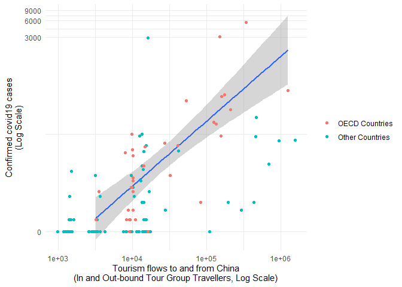

This document details the analysis for “Tracking the stealthy killer”.

### Packages and data:

    # Load country-china tour group data
    pdat <- read.csv("chinese_tourism.csv")

    # Load updated covid data
    JH <- read.csv("03-04-2020_JH_cases.csv" )

    # Merge the two
    JH$cases <- ave(JH$Confirmed, JH$Country.Region, FUN = function(x) sum(x))
    JH$country <- as.character(JH$Country.Region)
    JH$country[JH$country == "US"] <- "United States"
    JH$country[JH$country == "UK"] <- "United Kingdom"
    pdat$cases <- NULL
    pdat <- merge(pdat, unique(JH[, c("country", "cases")]), by = "country", all.x = T)

### Source for Chinese tourism data:

-   Ministry of Culture and Tourism of the People’s Republic of China
    (2020). See:
    <a href="http://zwgk.mct.gov.cn/auto255/202001/t20200102_850061.html?keywords=%E5%87%BA%E5%A2%83%E6%97%85%E6%B8%B8" class="uri">http://zwgk.mct.gov.cn/auto255/202001/t20200102_850061.html?keywords=%E5%87%BA%E5%A2%83%E6%97%85%E6%B8%B8</a>

The Ministry of Culture and Tourism track tour group visitors to and
from China on a consistent basis across the top 30 recipient/sender
countries and all other tour group travels by continent. For countries
which were not in the top 30, we distributed the remaining tourists to
that continent (‘Other Europe’ in the data) according to countries’
logged population size.

While not all tourists travel in tour groups, this data was the best
recent proxy for total tourism flows that we could identify. In
particular, it tracked both incoming and outcoming tourism, was
available for a broad set of countries, tracked tourists final
destination/origin, and was more recent than other sources (quarter 3 of
2019).

### Source for case data:

-   Dong E, Du H, Gardner L. An interactive web-based dashboard to track
    COVID-19 in real time. Lancet Infect Dis; published online Feb 19.
    <a href="https://doi.org/10.1016/S1473-3099(20)30120-1" class="uri">https://doi.org/10.1016/S1473-3099(20)30120-1</a>.

Countries which are not in John Hopkins’ data have zero confirmed cases:

    pdat$cases[is.na(pdat$cases)] <- 0

### Model:

In the next chunk, we fit a linear regression model in which tourism is
the IV and covid19 cases the DV (both logged):

    # Transform data to data.table format:
    pdat <- data.table(pdat)

    # Generate a few intermediary variables:
    pdat[, LogCases := log(cases + 1)][, LogTourists := log((outbound_tour_groups_Q3_2019_improved + inbound_tour_groups_Q3_2019_1_improved + 1) / 2)]

    # Fit a linear regression model on OECD countries:
    NoPopModel <- lm(LogCases ~ LogTourists, pdat[oecd == TRUE])

    # Print the summary of this model:
    summary(NoPopModel)

    ## 
    ## Call:
    ## lm(formula = LogCases ~ LogTourists, data = pdat[oecd == TRUE])
    ## 
    ## Residuals:
    ##      Min       1Q   Median       3Q      Max 
    ## -2.99309 -0.90473 -0.00519  0.86499  2.98859 
    ## 
    ## Coefficients:
    ##             Estimate Std. Error t value Pr(>|t|)    
    ## (Intercept)  -8.4363     1.7046  -4.949 2.30e-05 ***
    ## LogTourists   1.1313     0.1656   6.833 9.98e-08 ***
    ## ---
    ## Signif. codes:  0 '***' 0.001 '**' 0.01 '*' 0.05 '.' 0.1 ' ' 1
    ## 
    ## Residual standard error: 1.389 on 32 degrees of freedom
    ## Multiple R-squared:  0.5933, Adjusted R-squared:  0.5806 
    ## F-statistic: 46.69 on 1 and 32 DF,  p-value: 9.977e-08

    # Generate predictions for all countries
    pdat[, NoPopModPredictedLogCases := predict(NoPopModel, .SD)][, NoPopModPredictedCases := exp(NoPopModPredictedLogCases)][, NoPopModResidualLogCases := LogCases - NoPopModPredictedLogCases][, NoPopModResidualCases := cases - NoPopModPredictedCases]

    p <- ggplot(pdat[pdat$oecd, ], aes(y=cases, x=(inbound_tour_groups_Q3_2019_1_improved + outbound_tour_groups_Q3_2019_improved)/2))+
      geom_smooth(method = "lm")+
      scale_x_continuous(trans="log10")+
      scale_y_continuous(trans="pseudo_log")+
      geom_point(data=pdat[!pdat$oecd, ], aes(col="Other Countries"))+
      geom_point(aes(col = "OECD Countries"))+
      theme_minimal()+
      ylab("Confirmed covid19 cases\n(Log Scale)")+
      xlab("Tourism flows to and from China\n(In and Out-bound Tour Group Travellers, Log Scale)")+
      theme(legend.title = element_blank())

    print(p)

In models using data we cannot share here, we tested a range of other
predictors, including flight passengers from Wuhan by country of
destination in December, flights from Wuhan by destination country from
October 2019 to April 2020 (scheduled), as well as covariates such as
average temperature in January and February. Results were largely
similar. We also tried alternative modelling strategies, including
random forests, zero-inflated negative binomial models, and models which
used per-capita measures of infection rates rather than the absolute
number of confirmed cases, also with largely similar results.
